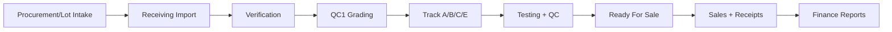

# One-Time Setup & Full App Tour (Visual Guidance)

This guide is written for first-time operators and admins.

## 1) One-Time Setup (Recommended Order)

## Step 1 — Prerequisites
- Node 20+ (recommended; 18+ minimum)
- npm
- Python 3
- Optional: Docker + Docker Compose plugin
- Optional: JDK 17+ (for Java LAN API)

## Step 2 — Configure environment
```bash
cp .env.example .env
```

Review `.env` values before first run (especially network host/port and API settings).

## Step 3 — Run bootstrap (first-time only)

### Linux / macOS
```bash
bash tools/bootstrap.sh
```

### Windows 11 (PowerShell)
```powershell
powershell -ExecutionPolicy Bypass -File tools/bootstrap.ps1
```

Notes:
- Bootstrap now attempts `npm ci` first, and automatically falls back to `npm install` when lock mismatch/policy errors occur.
- Use `--skip-system` / `-SkipSystem` if dependencies are already installed.

## Step 4 — Start through launcher (recommended)
```bash
npm run launcher
```

In launcher:
1. Click **0) Preflight Check**
2. Click **One-click Setup + Launch**
3. Share LAN URL shown in logs (example: `http://192.168.1.20:4173`)

## Step 5 — First-time production checklist
Before onboarding live users, confirm:
- [ ] Company profile and TRN are configured in **Settings → Company Info**.
- [ ] VAT/date/labor defaults are configured in **Settings → Financial/Inventory**.
- [ ] At least one supplier and lot import have been validated.
- [ ] Backup export/import drill was run once.
- [ ] One daily report export was generated successfully.

---


## Step 6 — Default seeded operator logins
The local Java auth server seeds Skyline users for quick first-time access:
- `id.skyline2@erp.com` ... `id.skyline31@erp.com`
- Password format: `userNskylinein` (for example, `id.skyline20@erp.com` uses `user20skylinein`)

Password reset for seeded users is available from **Settings → Diagnostics → Reset Seeded Skyline Passwords**.

## 2) First Shift Quick Validation (10 minutes)
1. Import a small test lot (2–5 units).
2. Verify units in Receiving Verification (scan + complete).
3. Grade units and ensure Track routing appears.
4. Open Processing Tracks and move one unit across a valid stage transition.
5. Create one WIP job, add labor/part, and export drilldown CSV.
6. Run Reports in **Daily** mode and export CSV/Excel/JSON.
7. Create a backup.

---

## 3) Visual System Flow



---

## 4) App Navigation Tour

## A. Dashboard
**Purpose**: KPI snapshot, alerts, activity, quick actions.

## B. Scanner
**Purpose**: fast barcode/unit lookup and route to next action.

## C. Inventory
- **Laptops**: stock visibility and state
- **Parts**: stock, reserve/consume/release workflows

## D. Receiving
- **Import Lot**: create intake records
- **Verification**: reconcile actual counts/scans
- **Grading**: assign class + route to track

## E. Processing
- **Tracks**: A/B/C/D/E operational overview
- **WIP Jobs**: diagnosis, parts usage, labor logging, stage movement

## F. Sales
- **New Sale**: create sale and complete transaction
- **All Sales**: list/search/export
- **Receipts**: payment receipt management

## G. Purchases
- **New Purchase**: supplier invoice + VAT details
- **All Purchases**: list/search/export
- **Payments**: payment tracking and exports

## H. Finance
- **Cash**: open/close day, cash entries
- **Owner**: owner ledger and exports
- **VAT**: VAT overview + export/print

## I. Master Data
- **Suppliers**
- **Lots**

## J. Reports
- report cards, export options, print-ready flow

## K. Settings
- application-level operational settings

---

## 5) Keyboard Shortcuts (Global)

- `Ctrl+/` → Scanner
- `Ctrl+S` → New Sale
- `Ctrl+L` → Import Lot
- `Ctrl+G` → Receiving Grading
- `Ctrl+Shift+L` → Inventory Laptops
- `Ctrl+Shift+P` → Inventory Parts
- `Ctrl+Shift+W` → WIP Jobs
- `Ctrl+Shift+R` → Reports
- `Ctrl+B` → Backup (downloads full app-state JSON)
- `Ctrl+Shift+B` → Restore backup (loads app-state JSON file)

---

## 6) Operator Best Practices

1. Run preflight before shift start.
2. Keep DB + Java API enabled for multi-user LAN sessions.
3. Export backup at least once per shift.
4. Review alerts panel at shift handover.
5. Use WIP + reports daily for bottleneck detection.

---

## 7) Troubleshooting Quick Map

- App not reachable on LAN → verify host IP + firewall + launcher URL.
- DB actions failing → verify Docker Compose plugin and `docker-compose.yml`.
- Java login failing → verify JDK installed and Java API service running.
- Slow behavior → run local build mode and verify machine resources.
- Bootstrap failed on `npm ci` → rerun bootstrap; it now falls back to `npm install` automatically.
- Reports export empty → verify selected period mode (Daily/Monthly) and source transactions exist in that range.
