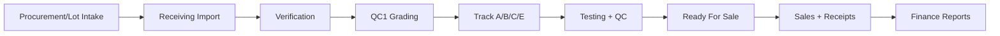

# One-Time Setup & Full App Tour (Visual Guidance)

This guide is written for first-time operators and admins.

## 1) One-Time Setup

## Step 1 — Prerequisites
- Node 18+
- npm
- Python 3
- Optional: Docker + Docker Compose plugin
- Optional: JDK (for Java LAN API)

## Step 2 — Configure environment
```bash
cp .env.example .env
```

Open launcher and edit `.env` if needed.

## Step 3 — Start through launcher (recommended)
```bash
npm run launcher
```

In launcher:
1. Click **0) Preflight Check**
2. Click **One-click Setup + Launch**
3. Share LAN URL shown in logs (example: `http://192.168.1.20:4173`)

---

## 2) Visual System Flow



---

## 3) App Navigation Tour

## A. Dashboard
**Purpose**: KPI snapshot, alerts, activity, quick actions.

## B. Scanner
**Purpose**: fast barcode/unit lookup and route to next action.

## C. Inventory
- **Laptops**: stock visibility and state
- **Parts**: stock, reserve/consume/release workflows

## D. Receiving
- **Import Lot**: create intake records
- **Verification**: reconcile actual counts/scans
- **Grading**: assign class + route to track

## E. Processing
- **Tracks**: A/B/C/D/E operational overview
- **WIP Jobs**: diagnosis, parts usage, labor logging, stage movement

## F. Sales
- **New Sale**: create sale and complete transaction
- **All Sales**: list/search/export
- **Receipts**: payment receipt management

## G. Purchases
- **New Purchase**: supplier invoice + VAT details
- **All Purchases**: list/search/export
- **Payments**: payment tracking and exports

## H. Finance
- **Cash**: open/close day, cash entries
- **Owner**: owner ledger and exports
- **VAT**: VAT overview + export/print

## I. Master Data
- **Suppliers**
- **Lots**

## J. Reports
- report cards, export options, print-ready flow

## K. Settings
- application-level operational settings

---

## 4) Keyboard Shortcuts (Global)

- `Ctrl+/` → Scanner
- `Ctrl+S` → New Sale
- `Ctrl+L` → Import Lot
- `Ctrl+G` → Receiving Grading
- `Ctrl+Shift+L` → Inventory Laptops
- `Ctrl+Shift+P` → Inventory Parts
- `Ctrl+Shift+W` → WIP Jobs
- `Ctrl+Shift+R` → Reports
- `Ctrl+B` → Backup (downloads full app-state JSON)
- `Ctrl+Shift+B` → Restore backup (loads app-state JSON file)

---

## 5) Operator Best Practices

1. Run preflight before shift start.
2. Keep DB + Java API enabled for multi-user LAN sessions.
3. Export backup at least once per shift.
4. Review alerts panel at shift handover.
5. Use WIP + reports daily for bottleneck detection.

---

## 6) Troubleshooting Quick Map

- App not reachable on LAN → verify host IP + firewall + launcher URL.
- DB actions failing → verify Docker Compose plugin and `docker-compose.yml`.
- Java login failing → verify JDK installed and Java API service running.
- Slow behavior → run local build mode and verify machine resources.
